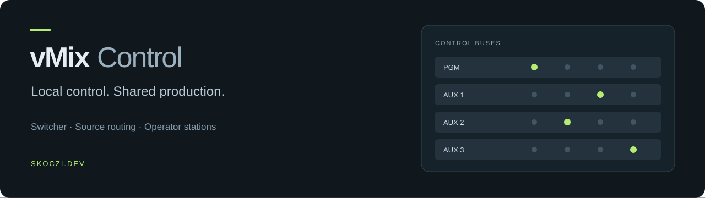

[](https://github.com/Skoczi/vmix-control/releases/latest)
[](https://github.com/Skoczi/vmix-control/actions/workflows/checks.yml)

A browser control surface for vMix. Run one server on your production network. Give each operator their own mix, source layout and switching controls.

**[Download](https://github.com/Skoczi/vmix-control/releases/latest)** · **[Setup guide](docs/SETUP.md)** · **[Changelog](CHANGELOG.md)** · **[Release archive](docs/RELEASES.md)** · **[Report an issue](https://github.com/Skoczi/vmix-control/issues)**

## At the controls

- **Switcher:** PROGRAM and PREVIEW banks, CUT, AUTO and selectable transition duration.
- **Source routing:** route inputs across up to 16 available mixes, or work with one selected mix. Mix names follow vMix.
- **Operator stations:** profiles, favorites, groups, source ordering and adjustable tile density. Drag handles and keyboard alternatives are included.
- **Production controls:** keyboard shortcuts, previous-source recall, focus mode and a local configuration lock.
- **Shared connection:** the local administrator selects the vMix address or starts demo. LAN operators join that connection automatically after login.
- **Access control:** optional shared password for LAN clients, with a required operator name at login. Connection and password configuration are restricted to the local administrator.
- **Demo:** 24 simulated inputs and 16 mixes, with shared PROGRAM/PREVIEW state. No vMix installation required.

English by default. Also available in Polish, German, French, Spanish, Romanian, Russian, Italian, Portuguese and Ukrainian. Source names from vMix are preserved.

## Start in three steps

1. Install **Node.js 22.13 or newer** and extract the [latest release](https://github.com/Skoczi/vmix-control/releases/latest).
2. In the extracted folder, run `node server.mjs --lan`. On Windows, you can use `START-LAN.bat`.
3. Open **http://127.0.0.1:3000** on the server computer. Connect to vMix or start demo. Other operators use the LAN address printed in the terminal.

The release archive works on **Windows, macOS and Linux**, despite the historical `windows` filename. It includes the built interface and server; **no `npm install` is needed** to run a release. vMix itself runs on a separate Windows computer or on the same Windows host.

## One server, independent stations

| Local administrator | LAN operator |
| --- | --- |
| Connect to vMix or start demo | Join the active server connection |
| Enable, change or disable the shared password | Log in and log out |
| Operate mixes | Choose and operate a mix |
| Configure their own station | Configure their own station |

Profiles, selected mix, language and layout are saved per browser. vMix state and demo state are shared by clients of the same server. Selecting a mix does **not** reserve it. The ON AIR control locks local configuration; it does not start streaming or lock out another operator.

## Switching behavior

Commands validate source and mix identities before sending. Commands on the same mix are serialized, and the server checks vMix XML to confirm the resulting source. Uncertain commands are not retried automatically. Stinger source confirmation does not confirm the end of its animation.

The interface displays source names and state. **It does not stream video previews or provide a T-bar.** Demo simulates switching state, not video rendering.

## Development

```bash
npm ci
npm test
npm run typecheck
npm run build:portable
```

The runnable bundle is written to `dist/windows/`. Run it with:

```bash
cd dist/windows
node server.mjs --lan
```

`npm start` runs the development interface. Keep the development server and the release server on separate ports; macOS can otherwise serve different instances on IPv4 and IPv6.

## Deployment notes

Use direct access on a trusted LAN. The bundled server uses HTTP and does not provide TLS. Loopback connections bypass the password and have administrator access; **do not place the application behind a loopback reverse proxy**. Read the [access and update notes](docs/SETUP.md#access-and-updates) before sharing the server.

Current automated coverage includes routing, mix identity, multi-operator contention, demo transitions, profiles, translations, password access and shared connection permissions. It does not replace testing against your vMix setup before a production.

---

© 2026 [Skoczi.dev](https://skoczi.dev) · Independent project. Not affiliated with or endorsed by vMix.

See the [PGM capability review](docs/PGM-CAPABILITIES.md) for implemented controls, vMix restrictions and the next production modules.
